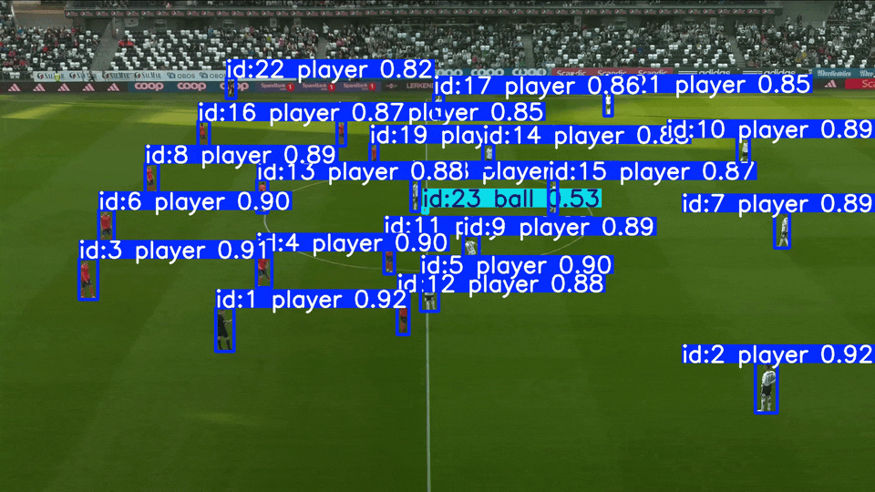
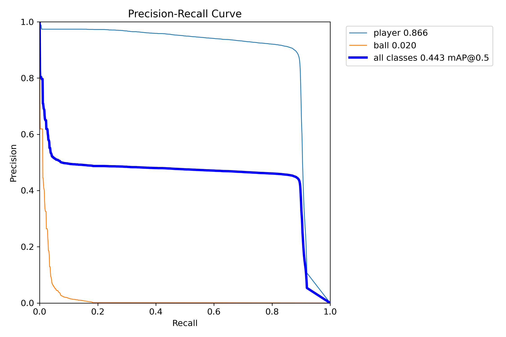
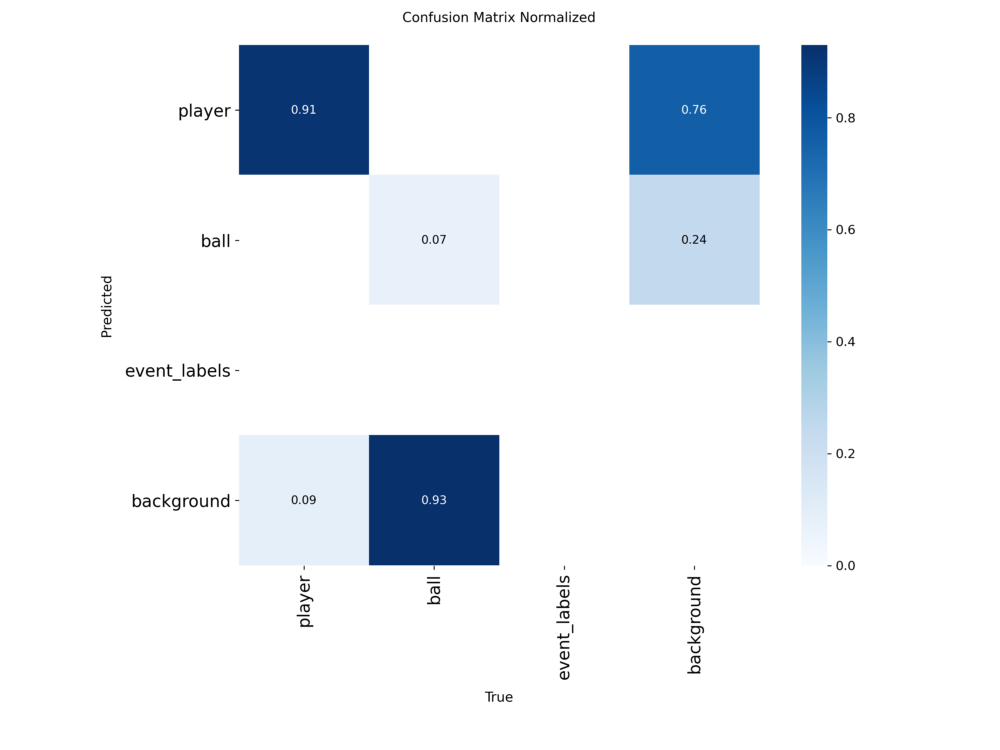
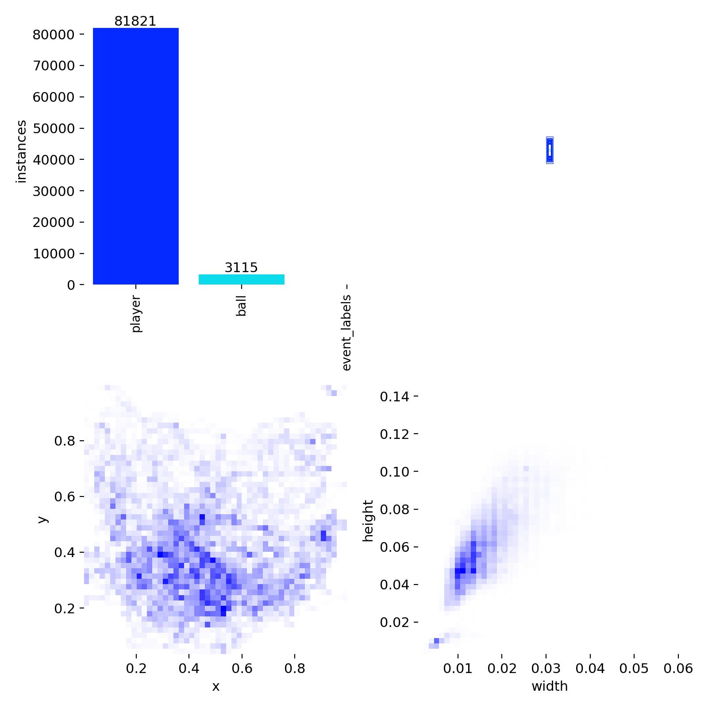
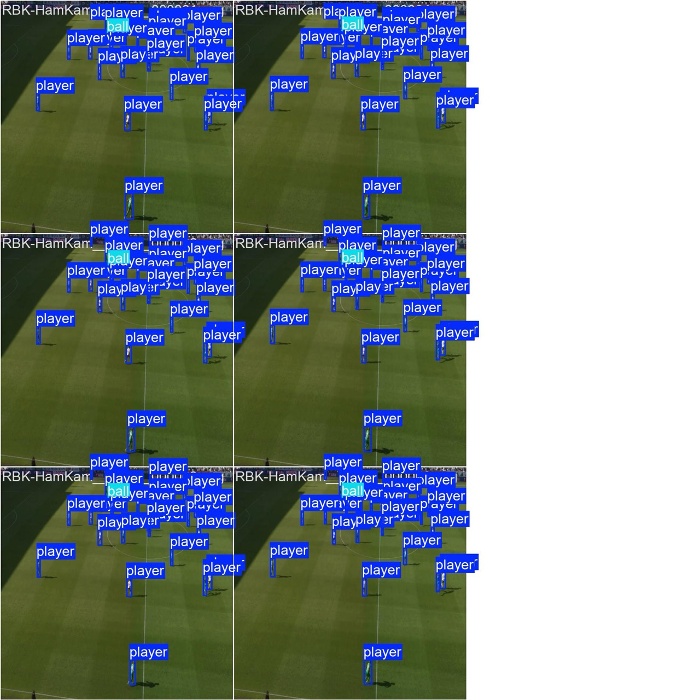
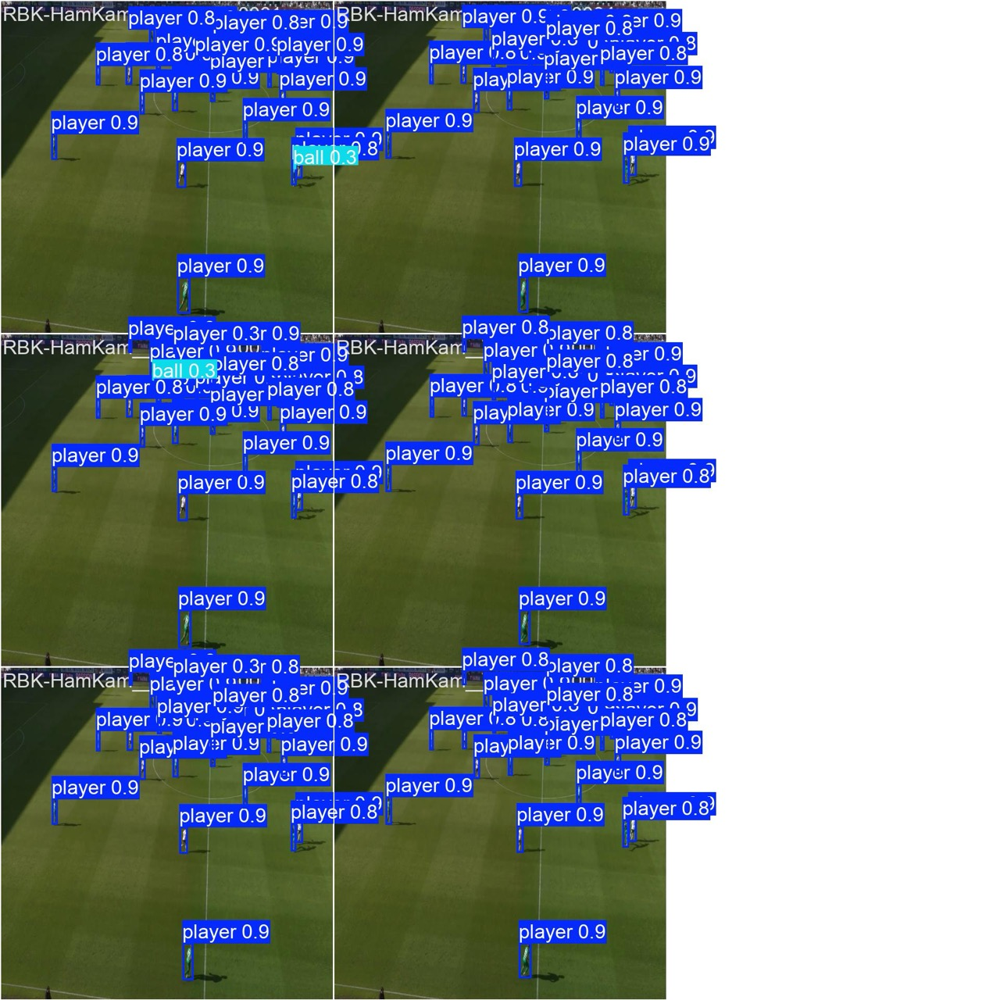

# football-vision

Detecting and tracking players and the ball in Rosenborg BK match footage, using a fine-tuned **RT-DETR** transformer detector and **ByteTrack** / **BoT-SORT** multi-object tracking.



*RT-DETR detections with ByteTrack IDs on a match at Lerkendal. Each box shows track ID, class and confidence.*

## How it works

```
video frame ──► RT-DETR-L (players + ball) ──► ByteTrack / BoT-SORT ──► tracks with persistent IDs
```

- **Detector:** RT-DETR-L, a real-time detection transformer pretrained on COCO and fine-tuned at 1280 px. It predicts boxes directly with no NMS step, which helps in crowded scenes where NMS can suppress overlapping players.
- **Tracking:** tracking-by-detection with ByteTrack and BoT-SORT. The two gave near-identical HOTA, so the demo uses ByteTrack because it is simpler and faster.
- **Data:** NTNU's Football2025 dataset of RBK home matches with player and ball boxes and CVAT track IDs, split by match so no frames leak between train, validation and test. The dataset cannot be redistributed, so this repository has no run guide. The code is here to show how the pipeline is built.
- **Compute:** trained on one NVIDIA A100 on NTNU's IDUN cluster through Slurm, about 5.5 GPU-hours.

## Results

**Detection** (validation set, RT-DETR-L at 1280 px):

| Metric | Player | Ball |
|---|---|---|
| AP@50 | 0.866 | 0.020 |
| Recall | 0.91 | 0.07 |

All classes: mAP@50 0.443, mAP@50:95 0.254.

**Tracking** (RT-DETR + ByteTrack / BoT-SORT, evaluated with [TrackEval](https://github.com/JonathonLuiten/TrackEval)):

| HOTA | DetA | AssA | LocA |
|---|---|---|---|
| 0.459 | 0.834 | 0.287 | 0.893 |

Player detection works well, while ball detection is the bottleneck. For tracking, detection and localisation are strong (DetA 0.83, LocA 0.89), but association is weak (AssA 0.29). Identities fragment when players occlude each other or a detection drops out for a few frames. ByteTrack and BoT-SORT scored almost the same, which suggests the limit is in the detections rather than the association method.

<p align="center">
  
  
</p>

## Why the ball is hard

Exploratory analysis of the training labels showed two problems before any training started:

- **Class imbalance.** There are 81,821 player boxes and 3,115 ball boxes, a ratio of about 26:1. The loss is dominated by players.
- **Tiny objects.** Players are about 1–2% of frame width. The ball is under 1%, so at the default 640 px input it covers only a few pixels.

<p align="center">
  
</p>

These findings shaped the training setup: input resolution was raised to 1280 px and the classification loss was upweighted (`cls=2.0`). This was not enough. 93% of balls are still predicted as background, and the balls that are found get low confidence (~0.3).

| Ground truth | Predictions |
|---|---|
|  |  |

## Improving ball detection

Both problems come from asking one model to find about 25 large players and one tiny ball in the same pass. The natural next step is a **dedicated ball detector**: a separate model trained only on the ball, running alongside RT-DETR for players. A ball-only model has no class imbalance to fight, and its size and resolution can be tuned for small objects alone. Only if that is not enough would I move on to more advanced methods.

## Project structure

```
models_training/
  run.py                  train locally or submit a Slurm job, configured by config.yaml
  train.py                Ultralytics RT-DETR fine-tuning
src/
  prepare_dataset.py      builds a symlinked dataset layout Ultralytics can read
  track.py                runs detection + tracking on video, writes MOT-format output
  cvat_to_mot.py          converts CVAT XML ground truth to MOT format
  evaluate_tracking.py    computes HOTA / MOTA / MOTP with TrackEval
```
